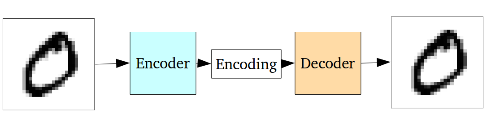
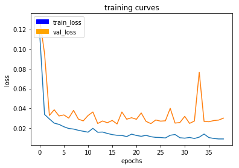
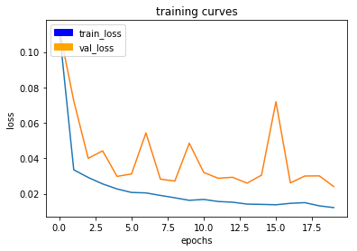
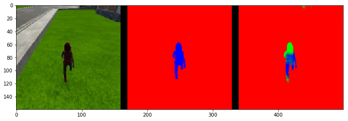
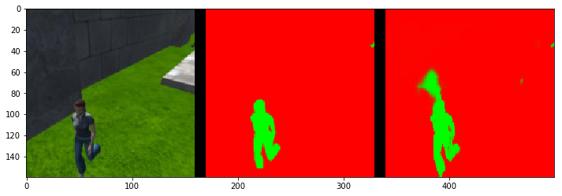

# Follow Me

## Network Architecture

We use a Fully Convolutional Network (FCN) for the project. Intuitively, this network is very similar to a Variational Auto Encoder (VAE). In a VAE, we feed the image to a few encoder blocks, which reduces the input's dimensions. This encoded output is then fed to a Decoder which results in an output which is the same size as the image. This helps in compressing the image to a lower dimensions without losing a lot of information. This ouput is compared directly with the input. We are essentially doing the same thing in the FCN segmentation network, but instead of comparing the ouput to the input, we compare the output to the input image's mask. This way the network learns to generate masks from inputs (instead of the inputs themselves in the case of the VAE).




We use 1x1 convolutions in the encoder phase of the network. These convolutions help preserve sptial information of pixels in the input. We replace the fully connected layers with fully convolutional layers. This reduced the input dimensions. If we only had a classification problem, we wouldn't have to use 1x1 convolutions since we don't need spatial data, i.e. know 'where' the object is.

Since our output is an image mask that is the size of the input, we need to increase the size of our lower dimension encoded output. To do this we use Transposed Convolutions to upsample. This is the Decoder part of the network.

Fortunately Keras gives us a summary of our network
```
_________________________________________________________________
Layer (type)                 Output Shape              Param #   
=================================================================
input_1 (InputLayer)         (None, 160, 160, 3)       0         
_________________________________________________________________
separable_conv2d_keras_1 (Se (None, 80, 80, 32)        155       
_________________________________________________________________
batch_normalization_1 (Batch (None, 80, 80, 32)        128       
_________________________________________________________________
separable_conv2d_keras_2 (Se (None, 40, 40, 64)        2400      
_________________________________________________________________
batch_normalization_2 (Batch (None, 40, 40, 64)        256       
_________________________________________________________________
separable_conv2d_keras_3 (Se (None, 20, 20, 128)       8896      
_________________________________________________________________
batch_normalization_3 (Batch (None, 20, 20, 128)       512       
_________________________________________________________________
conv2d_1 (Conv2D)            (None, 20, 20, 256)       33024     
_________________________________________________________________
batch_normalization_4 (Batch (None, 20, 20, 256)       1024      
_________________________________________________________________
bilinear_up_sampling2d_1 (Bi (None, 40, 40, 256)       0         
_________________________________________________________________
concatenate_1 (Concatenate)  (None, 40, 40, 320)       0         
_________________________________________________________________
separable_conv2d_keras_4 (Se (None, 40, 40, 128)       43968     
_________________________________________________________________
batch_normalization_5 (Batch (None, 40, 40, 128)       512       
_________________________________________________________________
separable_conv2d_keras_5 (Se (None, 40, 40, 128)       17664     
_________________________________________________________________
batch_normalization_6 (Batch (None, 40, 40, 128)       512       
_________________________________________________________________
bilinear_up_sampling2d_2 (Bi (None, 80, 80, 128)       0         
_________________________________________________________________
concatenate_2 (Concatenate)  (None, 80, 80, 160)       0         
_________________________________________________________________
separable_conv2d_keras_6 (Se (None, 80, 80, 64)        11744     
_________________________________________________________________
batch_normalization_7 (Batch (None, 80, 80, 64)        256       
_________________________________________________________________
separable_conv2d_keras_7 (Se (None, 80, 80, 64)        4736      
_________________________________________________________________
batch_normalization_8 (Batch (None, 80, 80, 64)        256       
_________________________________________________________________
bilinear_up_sampling2d_3 (Bi (None, 160, 160, 64)      0         
_________________________________________________________________
concatenate_3 (Concatenate)  (None, 160, 160, 67)      0         
_________________________________________________________________
separable_conv2d_keras_8 (Se (None, 160, 160, 32)      2779      
_________________________________________________________________
batch_normalization_9 (Batch (None, 160, 160, 32)      128       
_________________________________________________________________
separable_conv2d_keras_9 (Se (None, 160, 160, 32)      1344      
_________________________________________________________________
batch_normalization_10 (Batc (None, 160, 160, 32)      128       
_________________________________________________________________
conv2d_2 (Conv2D)            (None, 160, 160, 3)       99        
=================================================================
Total params: 130,521
Trainable params: 128,665
Non-trainable params: 1,856
_________________________________________________________________
```

We also use batch normalization after every layer. Usually we would normalize only the input, but in batch normalization we normalize the output of the a layer. This speeds up the learning process and adds a regularization factor while training by reducing margins between contrasting weight values.

Finally we use skip connections. Skips connection are connections from later decoder blocks to earlier encoder blocks. This helps in getting better segmentation information from the earlier layers before the image is downsampled. Usually there is some information lost while downlsampling during the encoding phase.

## Data Collection

Given the amount of importance and explanation given to the data collection part of the project explanation, I thought we were absolutely required to generate new data and the data already provided would be insufficient. But turns out the provided data is enough to generate a metric that meets the rubric expectation. Data Collection proved to be quite a pain without a good mouse so I would recommend it. Otherwise the provided data works right Out of the Box.

## Training
I went for commonly used parameters for the learning rate (0.01), a batch size divisible by 8. I started with 100 epochs, but the network started overfitting after the 20th epoch. The chart for 40 epochs is given below. I used 200 steps for `steps_per_epoch` (it was supposed to be `number of training examples/batch size` to iterate over the dataset but this figure just worked) and 50 for `validation_steps`. I didn't change the `workers` value from 2 (since it isn't a hyperparameter that affects the model's  accuracy and was recommended.)



The loss chart for 20 epochs



## Model Performance

The model performs pretty well on the training data. Here are a few examples

Following Hero. The hero looks a lot like every other person in the scene, so we can see the network sometimes partially identifies the hero as another person. The network also performs shakily when the hero is far away. If we were to recognize a hero object with a silhouette (mask) different from a human, our model would probably perform much better.





This network can be used for segmentation of other objects as well. In our project our inputs were images and their masks of people (in green) and the hero(in blue). For detecting other objects, we just need their masks with a different color for training (e.g., pink for dog, white for horse, yellow for cars, etc.).

## Performance on Simulator

The model performs pretty well in QuadSim and follows the hero (has slight trouble when the hero is far enough). The video is included in submission folder.

## Future Enhancements

The obvious and most common enhancement is a better dataset. I had trouble trying to get the quad to follow the hero during data collection, so I decided to offload to a friend who was kind enough to get a zipped dataset close to ~88MB. That datasets captures different scenarios which might help improve the model.

Another enhancement would be to change the network altogether. FCN was one of the first Neural Network Segmentation algorithm, and there are newer segmentation algorithms with [better results](http://blog.qure.ai/notes/semantic-segmentation-deep-learning-review).